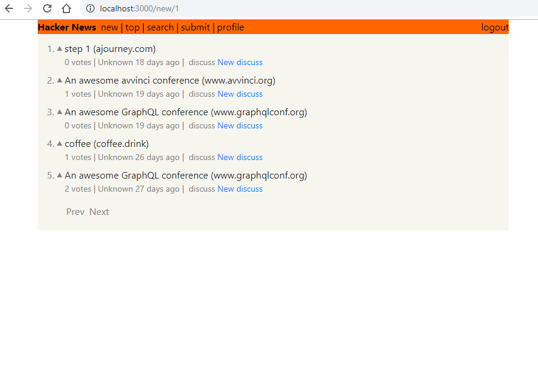

## Hackernews Clone (React + Apollo Client (GraphQL))

---

### Tech Stack
1. Reactjs
2. Apollo Client

### Done
1. Implemented Tutorial fully
2. Added Profile Page
3. Added Discuss Section
4. Added comment post feature
5. Added Profile pic upload 

### Doing
1. Improving comment section frontend
2. Writing a Blog about it - Problems Faced, Modules Understood ...  
3. Refactoring and Improvising code

### Todo
1. Fix Link Click
2. Find Why data fetch is too slow
3. Deploy
4. Add comment reply feature
5. Improve profile page
6. Improve comments by user
7. store image data in backend (profile pic)
8. Show user name in header
9. Improve overall ui
10. Fix upvote button glitch
11. Add loading animation, toasts to search upvote, comment post ..
12. Add ui for zero results returned in comments 
9999. Everything!
